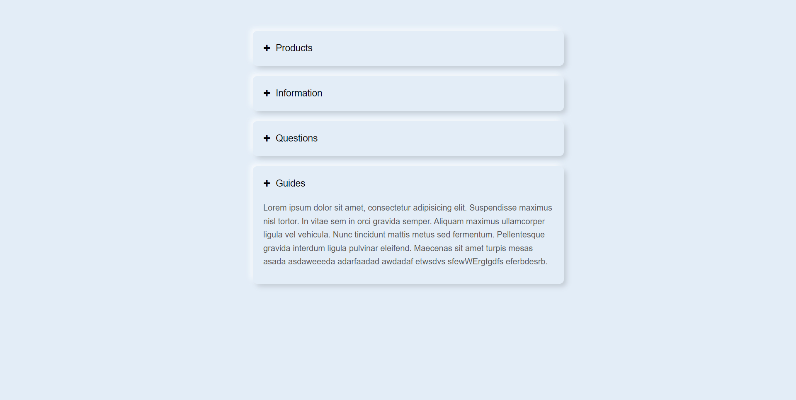

# Sacode Coding Dasar I Tugas Day 11
How To Make An Accordion Using HTML And CSS | Collapsible Content On Website

## Link Demo Di GitHub Pages 

Silahkan lihat melalui link berikut ini :
https://yohanesaragae.github.io/sacode-coding-dasar-i-tugas-day11/

## Screenshot Hasil Tugas Day 11

Berikut ini merupakan hasil Tugas Day 11 :

